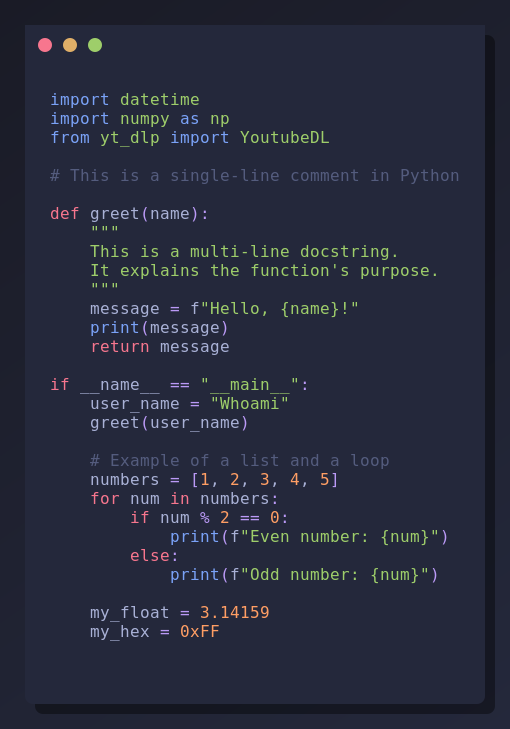

# screenCODE

This is a command-line tool written in C that generates a screenshot of source code files with syntax highlighting. It supports both C, Python adn Golang syntax highlighting and allows for customization of the window header.

## Features

- **Automatic Language Detection**: Automatically detects C, Python and Golang files based on their extension (`.c`, `.py` and `.go`).
- **Syntax Highlighting**: Provides syntax highlighting for C and Python code.
- **Disable Syntax Highlighting**: Option to disable syntax highlighting (`-no-color` flag).
- **Line Numbers**: Option to display line numbers (`-l` flag).
- **Customizable Window Header**: Choose between a gradient or solid color for the window header.
- **Generates PNG Output**: Saves the highlighted code as a PNG image.

## Dependencies

To build this project, you first need to install essential build tools like `gcc`, `make`, and `pkg-config`. After that, you'll need the development libraries for Cairo, Pango, GLib 2.0, and Fontconfig.

Here are some examples of how to install these dependencies on various systems:

- **Termux (Android)**:
  ```bash
  pkg install git clang make pkg-config libcairo pango glib fontconfig
  ```

- **Arch Linux**:
  ```bash
  sudo pacman -S git base-devel pkgconf cairo pango glib2 fontconfig
  ```

- **Debian/Ubuntu**:
  ```bash
  sudo apt install git build-essential pkg-config libcairo2-dev libpango1.0-dev libpangocairo-1.0-0 libglib2.0-dev libfontconfig1-dev
  ```

## Build Instructions

To build the project, first clone the repository and then navigate into its directory:

```bash
git clone https://github.com/Hydra0xetc/screenCODE.git
cd screenCODE
make
```

This will compile the source code and create an executable named `screenCODE` in the same directory.

## Usage

```bash
./screenCODE [OPTIONS] <input_file> <output_png>
```

### Options:

- `-lang `: Manually specify the programming language for syntax highlighting. If omitted, the language is auto-detected from the file extension.
- `-list-lang`: List supported languages.
- `-no-gradient`: Disable the gradient effect on the window header.
- `-l`: Display line numbers next to the code.
- `-t <title>`: Set a custom title for the window.
- `-Ts <size>`: Set the font size for the title (default: 12).
- `-no-color`: Disable syntax highlighting, showing plain text.

### Arguments:

- `<input_file>`: Path to the source code file to be screenshotted. Currently supports `.c` and `.py` files.
- `<output_png>`: Path where the output PNG image will be saved.

### Examples:

**Screenshot a C file with default gradient:**
```bash
./screenCODE -lang c test_c_code.c c_code_screenshot.png
```


**Screenshot a Python file without gradient:**
```bash
./screenCODE -lang python -no-gradient test_python_code.py python_code_screenshot.png
```


<details>
<summary>How it Works 👇</summary>

The `screenCODE` program is engineered to transform plain source code into a visually appealing PNG image that mimics a modern code editor's screenshot. The process involves several key stages, leveraging powerful libraries like Cairo for 2D graphics, Pango for text layout and rendering, and GLib for efficient data structures.

Here’s a detailed breakdown of the internal workflow:

1.  **Initialization and Argument Parsing (`main.c`)**:
    *   The program begins by initializing the `Fontconfig` library to ensure proper font discovery and management.
    *   It then parses all command-line arguments (`-lang`, `-l`, `-t`, etc.) to configure the output. If a language isn't specified with `-lang`, it's automatically detected from the input file's extension (`.c`, `.py`, `.go`).

2.  **Syntax Data Loading (`main.c`)**:
    *   Based on the determined language, a one-time initialization function (`init_syntax_tables_c`, `init_syntax_tables_python`, or `init_syntax_tables_go`) is called.
    *   This function loads language-specific keywords, built-in functions, and other syntax elements into `GHashTable`s (efficient hash tables from GLib). This up-front loading ensures that token lookups during the highlighting phase are extremely fast.

3.  **Code Highlighting (`syntax_highlighting.c`, `syntax_highlighting_*.c`)**:
    *   The core highlighting logic resides in the `highlight_syntax` function, which acts as a dispatcher. It calls the appropriate language-specific function (e.g., `highlight_python_syntax`).
    *   The language-specific function iterates through the source code line by line. For each line, it scans for tokens in a specific order of precedence:
        1.  **Multi-line constructs**: Checks for ongoing multi-line comments (C/Go) or strings (Python).
        2.  **Strings & Comments**: Identifies string literals (`"..."`, `'''...'''`) and comments (`//`, `/*...*/`, `#`).
        3.  **Numbers**: Recognizes various number formats (integers, floats, hex, etc.).
        4.  **Keywords & Identifiers**: It extracts words and checks them against the pre-loaded `GHashTable`s. Special logic handles context-dependent highlighting, like function names following a `func` keyword in Go or module names after an `import` in Python.
        5.  **Operators**: Matches against a sorted list of operators to find the longest possible match first (e.g., `>>=` before `>>`).
    *   Each recognized token is escaped to prevent Pango markup conflicts and then wrapped in a `<span>` tag with a specific `foreground` color (e.g., `<span foreground='#f7768e'>return</span>`).
    *   If line numbers (`-l`) are enabled, they are prepended to each line with consistent padding before the highlighting process begins.

4.  **Text Measurement and Image Sizing (`main.c`)**:
    *   Before creating the final image, the program uses a temporary Cairo surface and a Pango layout to accurately measure the pixel dimensions (width and height) of the fully highlighted, Pango-formatted text.
    *   This measurement is crucial for calculating the final image size, ensuring no code gets clipped. The final dimensions include padding, header height, and shadow offsets.

5.  **Image Rendering with Cairo (`main.c`, `drawing_utils.c`, `title_drawing.c`)**:
    *   A new Cairo surface (the canvas for our image) is created with the calculated dimensions.
    *   The background, a subtle drop shadow, and the main window frame with rounded corners are drawn.
    *   The window header is rendered, either as a solid color or a linear gradient, along with the decorative "traffic light" buttons.
    *   If a title (`-t`) was provided, it is drawn and centered in the header using `draw_window_title`.
    *   Finally, the Pango layout containing the highlighted code is rendered onto the Cairo surface at the correct position.

6.  **Output and Cleanup (`main.c`)**:
    *   The completed Cairo surface is saved to a PNG file at the specified output path.
    *   All allocated resources—memory for the code content, Pango layouts, Cairo surfaces, and the syntax hash tables—are meticulously freed to prevent memory leaks.

</details>
